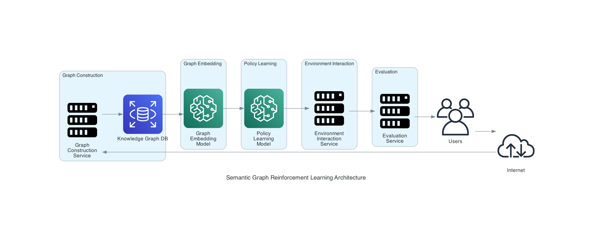

# 🌐 Semantic (Heterogeneous) Graph Reinforcement Learning

[](https://pre-commit.com/)
[](https://github.com/psf/black)
[](https://pycqa.github.io/isort/)
[](https://github.com/charliermarsh/ruff)
[](https://github.com/yourusername/semantic-graph-rl)
[](LICENSE)

This project implements a semantic graph reinforcement learning system using heterogeneous graph neural networks and the Mamba architecture.

**Note: 21.08.24 This project is a work in progress. Not functional yet.**

## ✨ Features

- 🌟 Heterogeneous Graph Neural Networks
- 🐍 Mamba-style transformations for node embeddings
- 🤖 Reinforcement Learning with Graph-based environments
- 📊 Graph expressivity evaluation
- 🧠 LLM feedback integration

## 🚀 Installation

1. Clone the repository:
   ```sh
   git clone https://github.com/yourusername/semantic-graph-rl.git
   cd semantic-graph-rl
   ```

2. Install dependencies using Poetry:
   ```sh
   poetry install
   ```

## 📂 Project Structure

- `semantic_graph_rl/`
  - `data/`: 📥 Data loading and processing
  - `models/`: 🧠 Neural network models
  - `utils/`: 🛠️ Utility functions
- `tests/`: 🧪 Unit tests
- `main.py`: 🚪 Main entry point

## 🛠️ Usage

To run the main script:

```sh
python main.py
```

## 🧩 How It Works

Semantic graph reinforcement learning combines graph neural networks with reinforcement learning to enable intelligent decision-making on graph-structured data. Below is a high-level overview of the process:

1. **Graph Construction**: 
   - The initial knowledge graph is created using domain-specific data.
   - Nodes represent entities, and edges represent relationships between entities.

   
   
   *EAAC example graph (from [here](https://github.com/arahangua/EAAC))*


2. **Graph Embedding**:
   - The graph is passed through a heterogeneous graph neural network to generate node embeddings.
   - These embeddings capture the structural and semantic information of the graph.

3. **Policy Learning**:
   - A reinforcement learning agent uses the node embeddings to make decisions.
   - The agent's policy is trained to maximize a reward signal, which is based on the task-specific objectives.

4. **Environment Interaction**:
   - The agent interacts with the environment by taking actions that modify the graph.
   - The environment provides feedback in the form of rewards, which guide the agent's learning process.

5. **Evaluation**:
   - The performance of the agent is evaluated based on its ability to achieve the desired outcomes.
   - Metrics such as graph expressivity and structure are used to assess the quality of the learned policy.



## 🧑‍💻 Development

### Pre-commit Hooks

This project uses `pre-commit` to manage pre-commit hooks for code formatting and linting. The following tools are integrated:
- `black` for code formatting
- `isort` for import sorting
- `ruff` for linting

To set up pre-commit hooks, run:

```sh
pre-commit install
```

To run the hooks on all files, use:

```sh
pre-commit run --all-files
```

To run tests:

```sh
pytest
```

To format code:

```sh
black .
```

To check code style:

```sh
flake8
```

## 🤝 Contributing

Please read [CONTRIBUTING.md](CONTRIBUTING.md) for details on our code of conduct and the process for submitting pull requests.

## 📜 License

This project is licensed under the GPL-3.0 License - see the [LICENSE](LICENSE) file for details.
